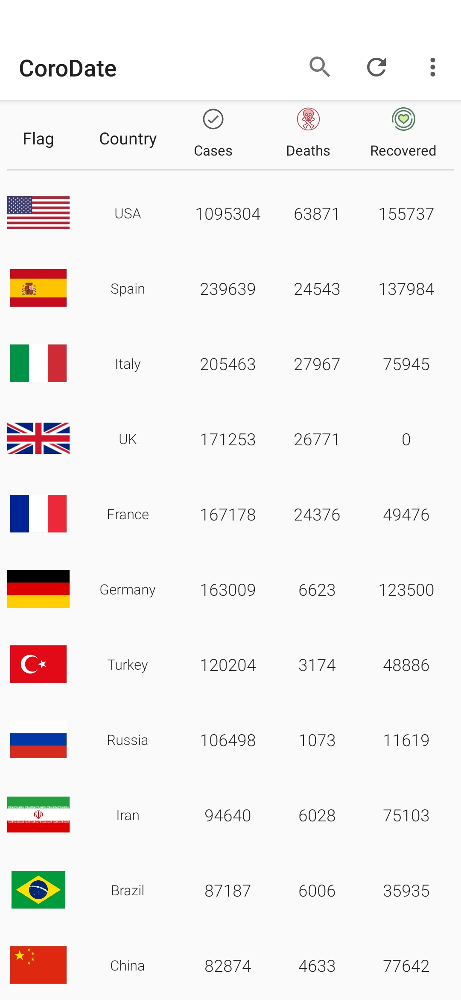
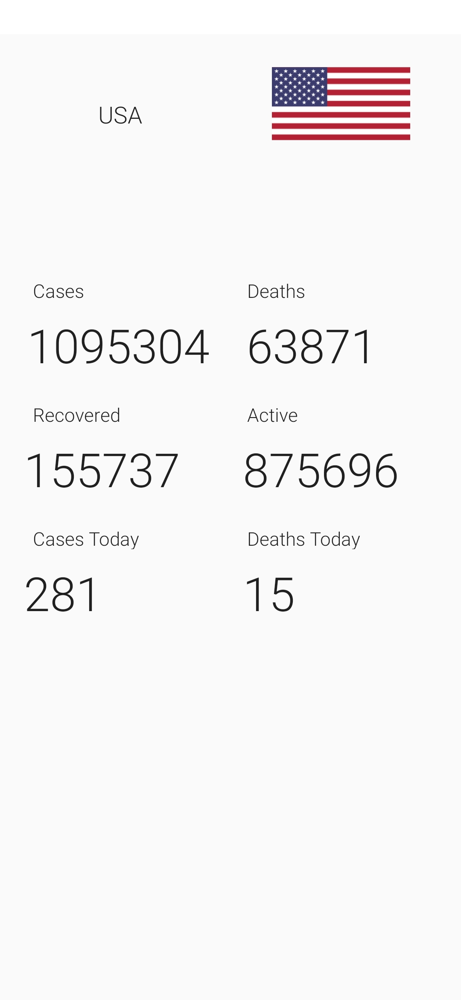
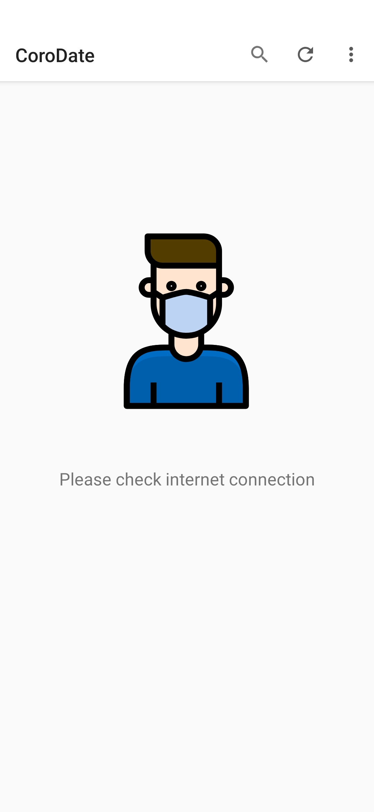

# CoroDate
Simple android app to get coronavirus updates

# Screenshots
    

# Installation
This is an Android Studio project and can be easily imported.

# Sources
https://github.com/NovelCOVID/API
